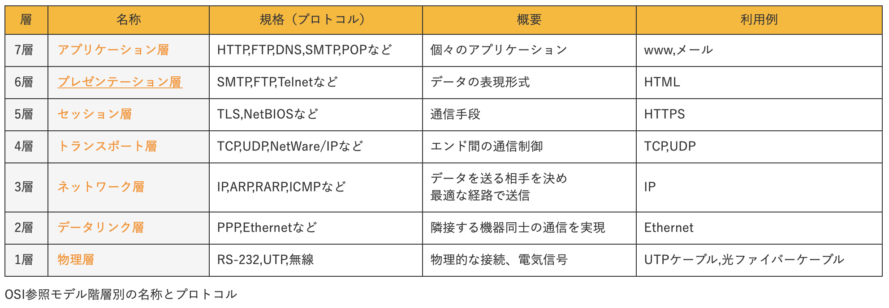

import Bleed from 'nextra-theme-docs/bleed'

# Network

## ■IP(Internet Protocol)

<Bleed>
  <iframe
    width="100%"
    height="430"
    src="https://www.youtube.com/embed/_2U4AujFgzI&list=PLavQwENTsEBVSgV-wUNz3Fb6yZ0jX0wSi"
    frameborder="0"
    allow="accelerometer; autoplay; clipboard-write; encrypted-media; gyroscope; picture-in-picture"
    allowfullscreen
  />
</Bleed>

### IPとは？
```
IPとは、データの送受信について定めたルール。
正式名称は、Internet Protocol（インターネットプロトコル）です。
現在のインターネットや企業などの限られた組織のネットワークのイントラネット(Intranet)では、IPのルールに基づき通信が行われている。
※イントラネット(Intranet)とは、内部（intra）ネットワークのこと。
```

### TCP/IPの役割
```
インターネットやコンピューター間でのデータのやり取りに使用される通信プロトコルはIPだけではありません。
通常「TCP（Transmission Control Protocol）」と呼ばれる、プロトコルとセットで使用されます。
これらは合わせて「TCP/IP」という名称で呼ばれています。

TCPは接続先の相手を確認した上でデータを送受信するプロトコルです。
一方、IPは相手先を気にしないプロトコルです。
代わりに高速な通信を実現します。
```

### IPパケットの概要
```
IPでは、コンピューター間でデータを送受信する際には、「IPパケット」が使用されます。
IPパケットは、データを収める箱のようなものです。

中身は大きく分けると、「IPヘッダ」と呼ばれるものと、「運ばれるデータ」から構成されています。
IPヘッダは、IPパケットの先頭に付け加える情報です。
ここには、IPのバージョンの他、送信先・宛先などの情報が書かれています。
運ばれるデータの種類としては画像（JPEG・PNGなど）、音声（WAV・mp3など）、動画（AVI・WMVなど）などがあります。
なお、一度に大きなデータを送ることはできません。
そこで利用環境に合わせてデータを分割する必要があります。
一度に送ることのできるデータサイズをMTU（Maximum Transmission Unit）といいます。
MTUはイーサネットにおけるLANケーブルでは最大1500バイト、光ファイバーでは最大4352バイトです。
ちなみにデータの分割をおこなっているのがTCPです。
```

### IPとIPアドレス
```
「IPアドレス」という言葉を聞いたことがあるかもしれません。
このIPアドレスとIPは同じものではありません。
IPアドレスはネットワークにある機器を識別するために割り当てられた「インターネット上の住所」のようなものです。
IPは、通信をおこなう際のプロトコルのことなので、IPアドレスとは異なります。
ちなみに、IPパケットの中のIPヘッダには、送信元・送信先のIPアドレス情報が収められています。
```
## ■TCP

<Bleed>
  <iframe
    width="100%"
    height="430"
    src="https://www.youtube.com/embed/HWomRvXSZfY&list=PLavQwENTsEBVSgV-wUNz3Fb6yZ0jX0wSi"
    frameborder="0"
    allow="accelerometer; autoplay; clipboard-write; encrypted-media; gyroscope; picture-in-picture"
    allowfullscreen
  />
</Bleed>

### TCPとは？
```
TCP（Transmission Control Protocol）は信頼性の高い通信を実現するためのプロトコル（通信規約）です。
OSI参照モデルにおけるトランスポート層にあたるプロトコルとなります。
OSI参照モデルとはネットワークシステムを7つの階層で表した概念のことです。
トランスポート層の役割は、通信品質を保つように調整することを目的としています。
```


### TCPの仕組みについて
```
データを送る際に、相手と仮想的なコネクションを確立し、それを通じて通信をおこなう「コネクション型」の通信です。
通信先の相手を確認しながらデータを転送することで、相手が確実にデータを受信したか、途中で破損していないかを検知します。
信頼性の高いプロトコルですが、データを送受信する度に、送信側と受信側で確認のやり取りが必要になるため速度は出にくいです。
```

### TCPの3つの基本機能
```
信頼性のある通信はTCPの基本機能である「フロー制御」「誤り制御」「輻輳制御（ふくそうせいぎょ）」により確立されています。
フロー制御とは、送信側と受信側でデータの取りこぼしを防ぐため、送信するパケットの量を受信側の能力に合わせて調整する機能です。
誤り制御とは、パケット（データ）の届く順番が正しいか、欠損していないかを検出する機能です。
輻輳制御とは、ネットワークの混雑状況によって送信するパケット量を調整し、データ消失を防ぐ機能です。
```

### TCP/IPの役割
```
「TCP/IP」はインターネットにおける標準的な通信プロトコルであり、TCPとIPをセットにしたものです。
画像や音声などのデータは一度に大量に送ることはできません。
IPパケットと呼ばれる箱に小分けにされて届けられるイメージです。
IPはIPパケットの順番を気にせずとにかくはやく届けることを目的としています。
一方TCPは、そのIPパケットを順番通りに並べ、届いていないものについては再送の要求をするなどし、確実に届けることを目的としています。
TCP/IPは現在のコンピューターネットワークを支えるために必要不可欠な技術です。
```

## ■WEB(ウェブ)

<Bleed>
  <iframe
    width="100%"
    height="430"
    src="https://www.youtube.com/embed/bMenDOK3mqk&list=PLavQwENTsEBVSgV-wUNz3Fb6yZ0jX0wSi"
    frameborder="0"
    allow="accelerometer; autoplay; clipboard-write; encrypted-media; gyroscope; picture-in-picture"
    allowfullscreen
  />
</Bleed>

### ウェブとは?
```
ウェブとは、インターネットを利用してウェブページなどをつなぎあわせた仕組みのことです。
これだけだと意味がわからないので、詳しく説明していきます。
ウェブとは、日本語で「くもの巣」という意味です。
ウェブの正式名称は、「World Wide Web（ワールド・ワイド・ウェブ）」です。
省略して「WWW」や「W3」と呼ばれることもあります。
World Wide Webを日本語に直訳すると、「世界規模のくもの巣」です。
情報を、まるでくもの巣のように、世界中に張り巡らされていることから名づけられました。
```

### ウェブの種類
```
ウェブの最小単位は「ウェブページ」です。
これは、リンクを踏むことなく見ることができるページのことです。
ウェブページにはそれぞれ、URLという「住所」が付けられています。
このウェブページが集まったものが「ウェブサイト」です。
例えば、ホームページやブログなどがそうです。
リンクを踏めば、ウェブサイト内外のページへ移動することができます。
```

### ハイパーテキストとは
```
他のウェブサイトに移動するために使われる仕組みが、ウェブの特徴である「ハイパーテキスト」です。
ハイパーテキストとは、日本語で「テキストを超えたテキスト」という意味です。
本を例に説明します。
本の1ページ1ページが「テキスト」です。
例えば、本の特定のページを読みたいとします。
特定のページを読むために、1ページずつ読み進めていかなければならないとなると大変です。
そのために、目次があります。
目次を見れば、特定のページが何ページ目にあるのかがわかり、他のページを抜かしてそのページまで一気に飛ぶことができます。
これと同様に、ハイパーテキストは、ウェブページのURL（目次・住所）をもとにそのページまで飛ばしてくれるシステムです。
```

### インターネットとは
```
ウェブと混同しやすい「インターネット」についても説明します。
インターネットとは、様々な情報をやり取りするための通信技術のことです。
イメージとしては、車やバイクが行き交う「道路」のようなものです。
インターネットを利用すると、電話、メール、コンピュータなどで「情報」を送受信することができます。
つまり、インターネットは通信技術。ウェブは、ウェブページなどをつなげあわせた仕組みのことです。
```

## ■URL

<Bleed>
  <iframe
    width="100%"
    height="430"
    src="https://www.youtube.com/embed/YQPNApy0tA0&list=PLavQwENTsEBVSgV-wUNz3Fb6yZ0jX0wSi"
    frameborder="0"
    allow="accelerometer; autoplay; clipboard-write; encrypted-media; gyroscope; picture-in-picture"
    allowfullscreen
  />
</Bleed>

### URLとは
```
URL（ユーアールエル）は「Uniform Resource Locator」の略称です。
URLは一言で表すと、「インターネット上の情報の住所」のことをいいます。
皆さんが日頃インターネット上で目にしているWEBページやファイルには、1つ1つにURLが設定されています。
```

### WEBページが表示される仕組み
```
URLの解説にあたって、WEBページが表示される仕組みから説明していきます。
私たちは、HTMLという種類のファイルをGoogleChromeやInternet Explorerなどのブラウザを使って開くことでWEBページを閲覧しています。
では、このHTMLというファイルはどこにあるのでしょうか？
HTMLは、個々のパソコンの中にあるわけではなく、インターネット上に存在しています。
そのため、私たちはHTMLがどこにあるかを探す必要があります。
その際に利用されるHTMLの場所が、URLとなります。
```

### URLの形式
```
URLには、一定の形式があります。
ここでは「http://www.○○.jp/□□/△△.html」を例として、それぞれの部分を簡単に解説します。
まず最初に、「http」はプロトコルと呼ばれる通信手段の名前です。
プロトコルとは、情報をやりとりするときに必要な取り決めのことです。
WEBでは「http」「https」というプロトコルが主に利用されています。
次に、「www.○○.jp」はホストとドメインを指しています。
ホストはネットワークに接続された機器やサーバーの名前を指しており、多くの場合「www」が使われています。
ドメインは、そのサイト専用の住所のことです。「○○.jp」がドメインにあたります。
「.jp」は持ち主の属性を表していて、他に「.com」や「.net」などがあります。
たとえば「.com」は商用・商業を指しているなど、それぞれ属性があります。
最後に、「□□/△△.html」はサーバー内のファイルの位置とファイル名を指しています。
「□□」の部分はディレクトリといい、簡単に言うとサーバー内のフォルダ名です。
「□□」というフォルダの中の「△△.html」というファイル、と理解していただくと分かりやすいかと思います。
まとめると、URLの基本構造は「プロトコル://ホスト.ドメイン/ディレクトリ/ファイル名」となります。
このように、URLを使ってインターネット上からHTMLファイルを特定し、それを開くことで私たちはWEBページを閲覧することができています。
```

## ■LAN

<Bleed>
  <iframe
    width="100%"
    height="430"
    src="https://www.youtube.com/embed/10x8A0nkg5o&list=PLavQwENTsEBVSgV-wUNz3Fb6yZ0jX0wSi"
    frameborder="0"
    allow="accelerometer; autoplay; clipboard-write; encrypted-media; gyroscope; picture-in-picture"
    allowfullscreen
  />
</Bleed>

### LANとは？
```
LANとはLocal Area Network（ローカールエリアネットワーク）のことであり、同一フロア内や建物の中といった限られた範囲で構築されたネットワークのことです。
ちなみにLANの反対がWAN（ワイドエリアネットワーク）と呼ばれるもので、こちらは離れたLAN同士をつなぐ大規模なネットワークとなります。
LANには「有線LAN」と「無線LAN」があります。
```

### 有線LANとは？
```
有線LANは有線によって直接接続された機器同士で構築されたLANです。
この有線LANでは、Ethernet（イーサネット）と呼ばれる通信規格（ルール）が一般的に用いられています。
Ethernetにおいては、同軸ケーブル・光ファイバー・LANケーブルの3つのケーブルの使用が定められています。
LANケーブルは、3つの中でコスト・利便性が優れているため、主流となっています。
```

### 有線接続のメリット・デメリット
```
有線接続のメリットは、機器同士をケーブルで接続するだけなので設定が簡単なことです。
また、ケーブルで繋がっているため、安定した通信が期待できます。

有線接続のデメリットは、配線がゴチャゴチャしホコリが溜まりやすいことです。
また、ケーブルの届く範囲でしか作業できません。
```

### 無線LANとは？
```
無線LANとはLANケーブルなどの有線を使わず無線によって構築されたLANです。
無線LANの環境においては、無線の親機（一般的には無線LANルーター）と、その子機がそれぞれ必要となります。
親機から送られた電波を、機器（パソコンなど）に取り付けた子機で受信することで、相互通信をおこないます。
```

### 無線LANのメリット・デメリット
```
無線LANのメリットは配線がいらないため部屋がすっきりすることです。
また、電波の届く距離なら離れた場所でも通信できることです。

一方、無線LANのデメリットは、電子レンジやBluetoothなど他の電波の影響を受けやすく通信が安定しないことです。
また設定されているセキュリティによっては、通信内容を盗聴されるリスクがあることです。
```

## WAN

<Bleed>
  <iframe
    width="100%"
    height="430"
    src="https://www.youtube.com/embed/ux-miSd8cC0&list=PLavQwENTsEBVSgV-wUNz3Fb6yZ0jX0wSi"
    frameborder="0"
    allow="accelerometer; autoplay; clipboard-write; encrypted-media; gyroscope; picture-in-picture"
    allowfullscreen
  />
</Bleed>

### WANとは？
```
WANは、世界中のコンピュータなど、遠くて広い範囲のネットワークのことを指します。
WANは、Wide Area Network（ワイド・エリア・ネットワーク）の略称です。
WANは、世界中の無数のコンピューター同士をつなぐことができます。
アメリカやアフリカなど異なる大陸間同士の通信では、高性能の海底ケーブルを通って世界中のコンピューターをつないでいます。
ネットワークには、WANの他にLANがあります。
```

### LANとは？
```
LANは、Local Area Network（ローカル・エリア・ネットワーク）の略称です。
LANは、企業内の同じフロアや家庭内など、近くて狭い範囲のネットワークを指します。
パソコン同士はもちろん、通信機器やプリンターなどでつながれたネットワークもLANと呼ばれます。
また、LANには有線LANと無線通信を用いた無線LANがあります。
```

### WANの構成について
```
WANは、すべての異なるLAN同士をつなげるためのネットワークです。
WANを利用するためには、インターネット用のIPアドレスと、ISP（インターネットサービスプロバイダ）と契約する必要があります。
代表的なISPには「NTT」「KDDI」「Softbank」などがあります。
WANにおいて一般的に使用されるケーブルは光ファイバーです。
光ファイバーは、伝送距離が長く伝送速度が速いのが特徴です。
```

### WANサービスの種類（専用型）
```
ISPでは、安全・快適・コストの3つを基準に、大きく分けて「専用型」と「交換型」のWANサービスを提供しています。
専用型では自社の専用線を持つことができるため、セキュリティが高く、安定した速度が期待できます。
しかし、自社で専用線をもつため、コストがかかります。
```

### WANサービスの種類（交換型）
```
交換型には「回線交換型」と「パケット交換型」があります。
回線交換型は特定の経路を確保して、通信が確立したときにだけ接続し、終わったら切断される仕組みです。
回線交換型は通信が終わらないと接続されないため、複数の相手と通信を行うことができません。
回線交換型は特定の経路を専有しているため、データの遅延が小さいのが特徴です。
パケット交換型は、送信するデータを小さなパケット単位に分けて通信をおこないます。
パケット交換型は、回線交換型と異なり回線を専有せずに複数のネットワークでデータのやりとりを行います。
そのため、複数の相手と通信をすることができます。
しかし、複数のネットワークを使うので、回線交換型と比べて、データ遅延の起きる可能性があります。
```

## ■HTTP

<Bleed>
  <iframe
    width="100%"
    height="430"
    src="https://www.youtube.com/embed/sKNF-sffx4k&list=PLavQwENTsEBVSgV-wUNz3Fb6yZ0jX0wSi"
    frameborder="0"
    allow="accelerometer; autoplay; clipboard-write; encrypted-media; gyroscope; picture-in-picture"
    allowfullscreen
  />
</Bleed>

### HTTPとは
```
HTTP（Hyper Text Transfer Protocol）は、インターネット上で通信をするときに使われる約束事の一つです。
通信をするときに使われる約束事のことを、通信プロトコルと言います。
たとえば、Webブラウザのアドレスバーに「http://www.abc.co.jp/」と入力したとします。
この場合、「HTTP」という通信プロトコルを使って「www.abc.co.jp/」にアクセスせよ、と命令を出していることになります。
```

### 通信プロトコルとは
```
では、なぜ「HTTP」のような通信プロトコルが必要なのでしょうか？
その理由を説明するために、まずはホームページが表示される仕組みを簡単に説明します。
私たちがホームページを見るとき、まずはWEBブラウザのアドレスバーにURLを入力します。
すると、WEBブラウザはWEBサーバに向けて、「このページが欲しい」と依頼を出します。
WEBサーバはページを探して、「このページです」とWEBブラウザに返します。
WEBブラウザはもらったページを画面上に表示します。
このように、WEBブラウザとWEBサーバがページの受け渡しをすることでホームページが表示されます。
このページの受け渡しをするときに必要なのが、通信プロトコル（約束事）です。
ホームページを見るとき、PCなのかスマホなのか、WindowsなのかMacなのか、環境は様々です。
しかし、環境の違いによってページの受け渡しの方法が異なっていたら不便です。
そこで、共通の「HTTP」という通信プロトコルを定めることで、どんな環境でも同じ手順でページの受け渡しをできるようにしたのです。
```

### HTTPの安全性
```
HTTPの他に、通信の内容を暗号化する「HTTPS」という通信プロトコルがあります。
HTTPのやり取りは安全性が低いとされています。
HTTPでのやり取りでは、通信の内容が暗号化されないからです。
第三者が不正な手段を使ってやり取りの間に入り込んできた場合、通信内容の盗聴や改ざんが行われる可能性があります。
そこで、通信の内容を暗号化する「HTTPS」という通信プロトコルが作られました。
第三者に知られたくない情報をやりとりする時は、HTTPSを使う必要があります。
```

## ■インターネット

<Bleed>
  <iframe
    width="100%"
    height="430"
    src="https://www.youtube.com/embed/x2peSgrTC9M&list=PLavQwENTsEBVSgV-wUNz3Fb6yZ0jX0wSi"
    frameborder="0"
    allow="accelerometer; autoplay; clipboard-write; encrypted-media; gyroscope; picture-in-picture"
    allowfullscreen
  />
</Bleed>

###　インターネットとは
```
インターネットとは、世界中のパソコンをはじめとした様々な機器同士を相互につないでくれるネットワークのことです。
インターネットは直訳すると「相互通信網」です。
インターネットは、様々なインターネットサービスの「経路」です。
インターネットという経路を通して、電子メールやIP電話、オンラインショッピングなどのサービスを利用できます。
```

###　インターネットの歴史
```
インターネットの歴史は、50年前に遡ります。
1969年、世界初のインターネット「ARPANET（アーパネット）」がアメリカで誕生しました。
「ARPANET」は、4台のコンピューターをつないだ軍事用のネットワークです。
その後、インターネットは世界各国の大学や研究所、企業に広まっていきました。
1984年には、日本初のインターネット「JUNET（ジェイユネット）」が誕生しました。
「JUNET」は、東京大学・東京工業大学・慶応義塾大学をつないだネットワークです。
1993年には、アメリカ国立スーパーコンピュータ応用研究所（NCSA）から、ホームページ閲覧ソフト（ブラウザ）である「NCSA Mosaic （エヌシーエスエー・モザイク）」が誕生しました。
「Mosaic」の誕生により、インターネット人口が急激に増えました。
インターネットの簡易化や低価格化にともない、大学や企業だけでなく一般の人々にもインターネットが普及していきました。
2016年時点で、日本におけるインターネット利用人口は約83％にも上ります。
```

###　インターネットの仕組み
```
インターネットを支える重要な仕組みが、インターネットプロトコル（IP）です。
インターネットプロトコルは、コンピューター同士が相互通信をする際の「規則」です。
コンピューター界の「共通言語」と言えます。
例えば、違う国の人同士が会話するとき、お互いの言語がわからないと何を言っているか理解できないです。
それと同様に、コンピューター同士も国や機器が違うとお互いの通信内容を理解することができません。
その問題を解消するために開発されたのがインターネットプロトコルです。
インターネットプロトコルという共通言語によって、種類や国の違うコンピューター同士が、インターネットを通じて会話することができます。
```

###　ウェブとは
```
インターネットと混同しやすい「ウェブ」についても説明します。
ウェブとは、インターネットを利用してウェブページなどをつなぎあわせた仕組みのことです。
ウェブの正式名称は、「World Wide Web（ワールド・ワイド・ウェブ）」です。
World Wide Webを日本語に直訳すると、「世界規模のくもの巣」です。
情報を、まるでくもの巣のように、世界中に張り巡らされていることから名づけられました。
つまり、インターネットとはネットワークであり、通信技術のことです。
一方、ウェブは、ウェブページなどをつなぎあわせた仕組みのことです。
```

## ■ポート番号

<Bleed>
  <iframe
    width="100%"
    height="430"
    src="https://www.youtube.com/embed/ruIRm5O5j14&list=PLavQwENTsEBVSgV-wUNz3Fb6yZ0jX0wSi"
    frameborder="0"
    allow="accelerometer; autoplay; clipboard-write; encrypted-media; gyroscope; picture-in-picture"
    allowfullscreen
  />
</Bleed>

### ポート番号とは？
```
ポート番号とは、webページを閲覧したり、データベースとやりとりするなど、アプリケーションと会話するための窓口の番号のことです。
ポート番号は、例えるなら銀行の窓口です。　
銀行では窓口の役割は決まっており、振込窓口では投資信託の相談はできません。
ポート番号も同様で、ポートによって対応するアプリケーションが異なります。
例えば、ホームページ（→Webサイト？）を閲覧する際に使用される、サーバー側のポート番号は通常「80番」です。
他の番号を割り当てることもできます。
しかし、サーバー側のポート番号を変更するとユーザーがアクセスできなくなってしまうため、通常番号は変更しません。
一方、クライアント側のポート番号はセキュリティの関係上毎回変わります。
```

### ポート番号の3つの範囲
```
ポート番号は、16ビットで最大「0～65535」までの数で表されるものです。
ポート番号は、範囲ごとに3つの名前があります。

1つ目は、「ウェルノウンポート番号：0～1023」です。
2つ目は、「登録済みポート番号：1024～49151」です。
3つ目は、「ダイナミック/プライベートポート番号：49152～65535」です。

ウェルノウンポート番号に登録されている番号は、TCPやHTTPなどの特定の通信プロトコルで使用されるポート番号群です。
通信プロトコルとは、通信をするときのルールのことです。
通信プロトコルには、TCP、UDP、HTTP、SMTP、POP3などがあります。
例えば、WebページにアクセスするためのHTTPなら80番、メールの送受信で使用されるSMTPなら25番、POP3の110番などがあります。
ウェルノウンポート番号は、ドメイン名の管理組織「IANA（アイアナ）」によって登録されています。

登録済みポート番号はウェルノウンポート番号ほどではありませんが、よく使うアプリケーションに割り振られているポート番号群です。
こちらもIANAによって管理されていますが、変更することもできます。
代表的な番号は、ユーザー認証に使用されるRadius（ラディウス）の1812番や、データベース管理システムであるMicrosoft SQL Serverの1433番などがあります。

ダイナミック/プライベートポート番号は、エフェメラルポートとも呼ばれる、用途の決まっていないポート番号群です。
サーバー側と通信する上でクライアント側が一時的に設定する番号となります。
こちらは固定された番号ではありませんが、49152～65535番の範囲で使用することをIANAは推奨しています。
```
